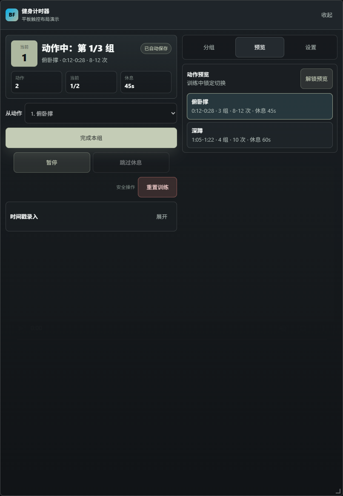

# Bilibili Fitness Timer

独立 Tampermonkey userscript，用 B 站视频片段辅助健身训练：录入动作时间戳后循环播放动作片段，完成一组后进入休息倒计时，倒计时结束播放提示音并继续下一组或下一个动作。

## 安装

GitHub raw 安装地址：

```text
https://raw.githubusercontent.com/RyanChouHua/bili-fitness-timer/main/dist/bili-fitness-timer.user.js
```

浏览器安装 Tampermonkey 后打开上面的地址即可安装。后续脚本通过 `@updateURL` 从 `dist/bili-fitness-timer.meta.js` 检查版本，再通过 `@downloadURL` 下载完整脚本。

## 功能

- 支持 `www.bilibili.com`、`m.bilibili.com`、`bilibili.com` 下包含 BV 号且存在 `video` 元素的播放页面。
- 非视频页面不会注入训练面板。
- 支持多行录入，例如：

```text
俯卧撑 00:12-00:28 3x8-12 rest45
深蹲 01:05-01:22 4x10 rest60
```

- 支持从当前视频时间插入开始/结束时间。
- 动作片段循环播放；训练主操作按钮会随状态显示“开始训练”“完成本组”或“继续”。
- “完成本组”使用居中的独立主按钮，平板触控时不会和上方控制行等宽，降低误触概率。
- “重置训练”独立放在安全操作区，训练中点击需要二次确认。
- 休息结束播放 Web Audio 提示音，支持 `1s / 2s / 3s / 5s`。
- 支持选择从某个动作开始训练。
- 支持本地 JSON 导入/导出，保留当前 BV 视频分组下的全部子分组、标题、作者和备注。
- 支持按 BV 号在线导入 GitHub raw 时间戳文件。
- 计划按当前 BV 号保存到 `localStorage`；一个 BV 是一个视频分组，视频分组下可保存多个子分组，适合周一到周六等不同训练项目。
- 支持当前视频分组的子分组管理，可新建或复制子分组；子分组列表中可直接切换、修改或删除，并编辑标题、作者和备注。
- 训练控制区和时间戳录入固定在左列；右列通过分组、预览、设置切换，子分组列表支持分页和滚动。
- 时间戳录入区保持单行动作格式，长动作名可横向滚动查看。
- 桌面和平板悬浮面板支持拖动位置和右下角拖拽缩放，收起后只保留小标题栏。
- 安卓平板、Via 等触控浏览器在 PC 模式下会使用接近平板效果图的单列触控布局，并用动态视口高度限制面板高度。
- 动作预览支持锁定/解锁，解锁后训练中可直接切换动作。
- PC 使用紧凑悬浮面板，平板和手机浏览器有响应式布局。

## 效果图



## 在线时间戳

在线时间戳放在仓库的 `timestamps/` 目录，文件名必须是：

```text
timestamps/<BV号>.json
```

脚本会按当前视频 BV 号请求：

```text
https://github.com/RyanChouHua/bili-fitness-timer/raw/refs/heads/main/timestamps/<BV号>.json
```

示例格式见 [timestamps/BV1xx411c7mD.json](timestamps/BV1xx411c7mD.json)。

```json
{
  "bvid": "BV1TT4y1f7A3",
  "title": "Video workout group",
  "groups": [
    {
      "title": "周一动作",
      "rawInput": "俯卧撑 00:12-00:28 3x8-12 rest45"
    },
    {
      "title": "周二动作",
      "rawInput": "深蹲 01:05-01:22 4x10 rest60"
    }
  ]
}
```

每个 `groups[]` 条目就是该 BV 视频分组下的一个子分组，例如 `周一动作`、`周二动作`。子分组优先使用 `rawInput`；如果没有 `rawInput`，会从 `exercises` 生成录入文本。旧版单计划 JSON 仍兼容，会作为一个子分组导入。404、网络失败或 JSON 格式错误时，不覆盖本地已有数据。

## 开发

标准开发流程：

1. 先阅读本 `README.md`，确认安装入口、功能范围、发布要求和维护注意事项。
2. 开始修改前执行 `git status --short`，确认当前工作区是否干净；必要时先 `git pull origin main` 同步 GitHub。
3. 读取相关源码和配置，例如 `package.json`、`vite.config.ts`、`src/main.ts`、`scripts/check.mjs`，不要凭空假设命令或目录。
4. 按任务做最小必要修改；涉及 userscript 行为时同步更新 `src/` 和构建后的 `dist/`。
5. 使用项目已有命令验证：`npm run test`、`npm run typecheck`、`npm run build`。
6. 需要浏览器效果验证或 README 效果图时执行 `npm run screenshot:tablet`，通过 Playwright 调用浏览器生成截图。
7. 提交前检查 `git diff` 和 `git status --short`，只 `git add` 本次相关文件。
8. 用 Git 提交并推送 GitHub：`git commit -m "<message>"`、`git push origin main`。

```bash
npm install
npm run test
npm run typecheck
npm run build
npm run screenshot:tablet
```

构建产物：

```text
dist/bili-fitness-timer.user.js
```

`dist/bili-fitness-timer.user.js` 需要提交到 Git，因为它是 GitHub raw 安装和 Tampermonkey 自动更新入口。
`dist/bili-fitness-timer.meta.js` 也需要提交到 Git，因为 Tampermonkey 用它检查更新版本。

## Git / GitHub 维护

版本发布建议按下面顺序操作：

```bash
git status --short
npm version <新版本号> --no-git-tag-version
npm run test
npm run typecheck
npm run build
npm run screenshot:tablet
git diff
git add package.json package-lock.json vite.config.ts src/main.ts README.md scripts/screenshot-tablet.mjs dist/bili-fitness-timer.user.js dist/bili-fitness-timer.meta.js pic/tablet-training-controls.png
git commit -m "Release <新版本号>"
git push origin main
```

注意事项：

- `package.json` / `package-lock.json` 的 `version`、`vite.config.ts` 里的 userscript `@version` 要保持一致。
- 每次改动脚本后都要重新执行 `npm run build`，并提交 `dist/bili-fitness-timer.user.js` 与 `dist/bili-fitness-timer.meta.js`。
- GitHub raw 安装地址依赖 `main` 分支上的 `dist/`，push 后 Tampermonkey 才能检查到新版本。
- 提交前先看 `git status --short` 和 `git diff`，不要把本地草稿、账号信息、token 或无关文件带进提交。
- 需要在 GitHub 管理问题时优先使用 issue / PR 记录复现、修复和验证；不要在未确认前删除分支、关闭 issue 或改 protected branch。

## Playwright 验证

平板效果图由 Playwright 脚本生成：

```bash
npm run screenshot:tablet
```

脚本已将下面的便携 Chrome 写入 Playwright 首选调用路径：

```text
C:\A_Program\portable_apps\Browse\Chrome\App\chrome.exe
```

如果使用便携浏览器，可显式指定路径：

```powershell
$env:CHROME_PATH='C:\A_Program\portable_apps\Browse\Chrome\App\chrome.exe'
npm run screenshot:tablet
```

注意事项：

- 脚本会优先尝试 `CHROME_PATH`，如果便携 Chrome 不兼容 Playwright 启动方式，会自动尝试常见 Chrome / Edge 路径。
- 截图前先执行 `npm run build`，确保截图使用的是最新 `dist/bili-fitness-timer.user.js`。
- 生成结果固定写入 `pic/tablet-training-controls.png`，README 会直接引用这张图。
- 如果用 MCP Playwright 调浏览器，注意它可能固定寻找默认 Chrome 路径；便携 Chrome 在 `remote-debugging-pipe` 模式下可能会启动后立即退出，此时优先使用 `npm run screenshot:tablet`。

## 版本记录

### 0.4.18

- 重构安卓平板触控界面：训练状态、当前动作和主操作优先展示，分组、预览、设置降为次级工作区。
- 使用低干扰深色主题、Jade/Cool Blue 状态色和统一按钮层级，降低看视频训练时的视觉干扰。
- 放大平板触控目标，主训练按钮、次级控制、列表项和表单控件更适合平板浏览器点击。

### 0.4.17

- 优化平板触控训练控制区：主操作固定为居中大按钮，训练中显示“完成本组”。
- 将“暂停”“跳过休息”作为次要控制，将“重置训练”移到安全操作区。
- 训练中执行“重置训练”需要二次确认，避免误触清空当前进度。
- 补充平板控制区效果图，便于 GitHub README 预览。

## 发布

常规发布优先按上面的 Git / GitHub 维护流程执行。最小命令示例：

```bash
npm run test
npm run typecheck
npm run build
npm run screenshot:tablet
git status --short
# 只添加本次相关文件，例如：
git add README.md src/main.ts dist/bili-fitness-timer.user.js dist/bili-fitness-timer.meta.js
git commit -m "Release userscript"
git push origin main
```
